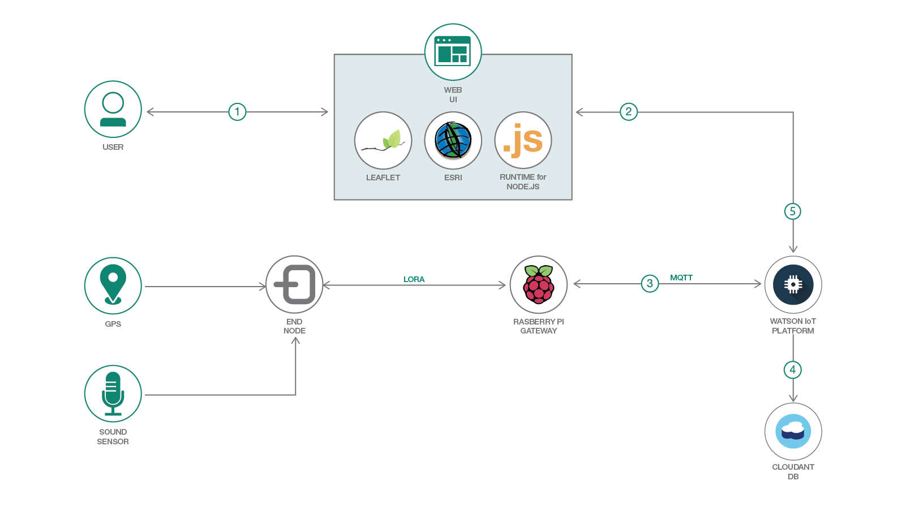

<!-- Add a new Title and fill in the blanks -->
# IoT - Asset Tracking with Leaflet and ArcGIS

In this Code Pattern composite, we'll demonstrate how to track assets and visualize incoming sensor data from the Watson IoT Platform on a mapping application using Leaflet.js and ArcGIS. This is a continuation of the "Smart City" code pattern composite. This application targets two primary use cases:

The first use case is tracking moving IoT assets. This can be anything that has a GPS module attached, whether that be a shipping truck, a tagged wild animal, etc.

The second use case is to visualize sensor data associated with various connected IoT devices. This sensor data can represent any measurable physical property, such as temperature, sound, air quality, humidity, etc.


```
"d" : {
  "node_id": "asset1",
  "lat": "-118.417392",
  "long": "34.0057",
  "timestamp": "2018-06-30T07:10:55.174Z",
  "sensor": {
    "sound": "72",
  }
}
```


## Application Workflow Diagram



1. User registers an "end node" via the mapping UI or a MQTT message. This end node represents a trackable asset capable of publishing location and sensor data.

2. Express backend subscribes to Watson IoT Platform channel corresponding to one or more end nodes.

3. End Node continuously publishes JSON object containing location, time, and sensor data to Watson IoT Platform

```
{
  d: {
    node_id: "asset1",
    longitude: "-118.417392",
    latitude: "34.100057",
    timestamp: "2018-06-30T07:10:55.174Z",
    sensor: {
      sound: "72"
    }
  }
}
```

4. Message persists in Cloudant DB

5. Front end (Leaflet.js) updates marker location on map

## Install Prerequisites:

### Node.js packages
If expecting to run this application locally, please continue by installing [Node.js](https://nodejs.org/en/) runtime and NPM. If your system requires multiple versions of Node for other projects, we'd suggest using [nvm](https://github.com/creationix/nvm) to easily switch between Node versions. NVM can be installed with the following commands
```
curl -o- https://raw.githubusercontent.com/creationix/nvm/v0.33.11/install.sh | bash
# Place next three lines in ~/.bash_profile
export NVM_DIR="$HOME/.nvm"
[ -s "$NVM_DIR/nvm.sh" ] && \. "$NVM_DIR/nvm.sh"  # This loads nvm
[ -s "$NVM_DIR/bash_completion" ] && \. "$NVM_DIR/bash_completion"  # This loads nvm bash_completion
nvm install v8.9.0
nvm use 8.9.0
```

To run the UI locally, we'll need to install a few node libraries which are listed in our `package.json` file.
- [Leaflet.js](https://leafletjs.com/): Open source library for interactive mapping
- [MQTT](http://mqtt.org/): Client package to subscribe to Watson IoT Platform and handle incoming messages

Install the listed node packages by running `npm install` in the project root directory.
```
npm install
```

Start the application with
```
node app.js
```


## Included components
* [Watson IoT Platform](https://console.bluemix.net/catalog/services/blockchain)
* [Cloudant DB](https://console.bluemix.net/catalog/services/cloudant)


## Prerequisites
<!-- Select components from [here](https://github.ibm.com/developer-journeys/journey-docs/tree/master/_content/dev#technologies), copy and paste the raw text for ease -->
* [npm](https://www.npmjs.com/)
* [node.js](https://nodejs.org/en/)
* [leaflet.js](https://leafletjs.com/)
* [ArcGIS](https://console.bluemix.net/catalog/services/esri-arcgis-for-developers)


# Steps
There are two methods we can use to deploy the application, either use the ``Deploy to IBM Cloud`` steps **OR** create the services and run locally.
1. [Clone repository](#1-clone-the-repository)
2. [Setup repository codebase locally](#2-deploy-application-locally) OR [Deploy to IBM Cloud](#2-deploy-application-to-ibm-cloud)
3. [Create Watson services with IBM Cloud](#3-create-services)
4. [Retrieve service credentials](#4-obtain-service-credentials)
5. [Configure and run the application](#5-run-the-application)
6. [Visualize assets in UI](#6-visualize-assets-in-UI)

## 1. Clone the repository

Clone the `iot-mapping` project locally. In a terminal, run:

```
git clone github.com/IBM/iot-mapping
```

## 2. Deploy Application to IBM Cloud

1. To deploy the application to IBM Cloud, we'll need to leverage the IBM Cloud CLI. Ensure the cli is installed using the prerequisites section above, and then run the following command to deploy the application
```
ibmcloud cf push
```

2. To see the app and services created and configured for this Code Pattern, use the IBM Cloud dashboard, or run `ibmcloud cf apps` and `ibmcloud cf services` in the terminal. The app should be named `iot-mapping` with a unique suffix.

## 2. Deploy Application locally
Install the IoT Mapping node packages by running `npm install` in the project root directory.
```
npm install
```
Start the application with
```
npm start
```
<!-- ### Docker setup (optional)
If you have Docker installed, you can install these dependencies in a virtual container instead. Run the application with the following commands, and then skip to [Step 5](#5-configure-credentials)
```
docker build -t monitoring_ui .
docker run -d -p 8081:8081 monitoring_ui
``` -->

> NOTE: These steps are only needed when running locally instead of using the ``Deploy to IBM Cloud`` button.

<!-- there are MANY updates necessary here, just screenshots where appropriate -->

## 3. Create Services

Next, we'll need to deploy our service instances using the IBM Cloud dashboard.

### Watson IoT Platform

Navigate to the IBM Cloud dashboard at [https://console.bluemix.net/](https://console.bluemix.net/) and click the "Catalog" button in the upper right
<p align="center">

</p>

In the search bar type "IoT" and click the icon titled "Internet of Things Platform Starter".

<p align="center">

</p>

Select the pricing plan and click "Create". If deploying on an IBM Lite account, be sure to select the free "Lite" plan

#### Additional Configuration: Generate Watson IoT service credentials

After being provisioned, the Watson IoT Platform service will need a bit of additional configuration, as we'll need to generate a set of credentials for connecting to the broker. We can do so by entering the IoT Platform dashboard, selecting "Devices" from the left hand menu, and then clicking the "Add Device" button.


<p align="center">

</p>

Next, provide a device type and ID.
<p align="center">

</p>

The next few tabs (Device Information, Groups, Security) can be left as is with the default settings.

<p align="center">

</p>

Clicking the "Finish" button will register a device and generate a set of credentials that can be used to publish messages to the IoT Platform. Be sure to take note of the Device type and Device ID, and place both in the `cfcreds.env` file.

We'll need to generate a different set of credentials to be able to publish and subscribe to the MQTT Broker
<!-- <p align="center">

</p> -->

We can do so by selecting the "Apps" option in the left hand menu. Then, click the "Generate API Key" button
<p align="center">

</p>

We can leave the fields in the "Information" blank and click next.
In the "Permissions" tab, we'll select the "Backend Trusted Application" role. Once this is selected, click "Generate Key"
<p align="center">

</p>

The result will give us an API Key and Authentication Token. These can be supplied as the username and password for a MQTT client. To make setup a bit easier, place these values in the `cfcreds.env` file as IOT_API_KEY and IOT_APP_AUTH_TOKEN
<p align="center">

</p>

## 4. Obtain service credentials

Now that we've instantiated our Watson IoT Platform service instance and the corresponding MQTT credentials, we'll next need to place the credentials into a `.env` file in our application root directory. This will allow for the application to authenticate to the MQTT broker and listen for updates from registered IoT devices.

```
IOT_API_KEY=
IOT_AUTH_TOKEN=
IOT_ORG_ID=
IOT_DEVICE_ID=
IOT_DEVICE_TYPE=
IOT_EVENT=
```

<!-- We can obtain the Blockchain credentials by downloading

Copy the [`env.sample`](env.sample) to `.env`.

```
$ cp env.sample .env
```
Edit the `.env` file with the necessary settings.

#### `env.sample:`

```
# Replace the credentials here with your own.
# Rename this file to .env before starting the app.

# Watson conversation
CONVERSATION_USERNAME=<add_conversation_username>
CONVERSATION_PASSWORD=<add_conversation_password>
WORKSPACE_ID=<add_conversation_workspace>

# Watson Discovery
DISCOVERY_USERNAME=<add_discovery_username>
DISCOVERY_PASSWORD=<add_discovery_password>
DISCOVERY_ENVIRONMENT_ID=<add_discovery_environment>
DISCOVERY_COLLECTION_ID=<add_discovery_collection>

# Watson Natural Language Understanding
NATURAL_LANGUAGE_UNDERSTANDING_USERNAME=<add_nlu_username>
NATURAL_LANGUAGE_UNDERSTANDING_PASSWORD=<add_nlu_password>

# Watson Tone Analyzer
TONE_ANALYZER_USERNAME=<add_tone_analyzer_username>
TONE_ANALYZER_PASSWORD=<add_tone_analyzer_password>

# Run locally on a non-default port (default is 3000)
# PORT=3000

``` -->


## 5. Run the application

1. Start the app locally with `node app.js`.

2. Enter the following URL in a browser: `http://localhost:3000/` </br>**Note:** If you run into an issue with the port already being used, set the `PORT` environment variable to the port you'd like to use.
<!--Add a section that explains to the reader what typical output looks like, include screenshots -->

<!-- <TODO, update picture> -->
<p align="center">

</p>

<!--Include any troubleshooting tips (driver issues, etc)-->

## 6. Visualize assets in UI


Now, we can actually confirm that the UI is able to visualize asset locations and sensor data.

There are a few ways to import data to be viewed in the mapping application.

Each option requires the following
- A unique string identifier, corresponding to the specific IoT device.
- A set of Longitude/Latitude coordinates
- A timestamp, which should be represented as either the UTC epoch format or the ISO-8601 format.
- Sensor value(s) in a key/value format, ex. `sound: 65` (Optional)

The first option is to create a node manually. This can be done by clicking the "Add Node" button and entering the required values. Once they have been entered, pressing "Create" should render a marker like so. A transparent circle will also be added if a sensor is provided, and the radius length is determined by the sensor value


In a live scenario, these updates should come in the form of MQTT messages sent by associated IoT devices. Each device can broadcast an update by publishing a MQTT message with the following payload:

```
mqtt_pub -v -i "a:${IOT_ORG_ID}:client_pub1" -u "${IOT_API_KEY}" -P "${IOT_AUTH_TOKEN}" -h 'agf5n9.messaging.internetofthings.ibmcloud.com' -p 1883 -t "iot-2/type/${IOT_DEVICE_TYPE}/id/${IOT_DEVICE_ID}/evt/assetMapper/fmt/json" -m '{
    "d" : {
    "node_id": "node2",
    "lat": "-118.317392",
    "long": "34.100057",
    "timestamp": "2018-06-30T07:10:55.174Z",
    "sensor": {
      "sound": "72"
    }
  }
}'
```

We can also bulk import CSV datasets. In this example, we'll use data from tracking a herd of zebra in Botswana, which can be downloaded [here](https://www.datarepository.movebank.org/handle/10255/move.343). This file can be loaded by clicking the "Import CSV File" button.


Once the file is loaded, headers will need to be selected to identify which columns correspond to each individual node id, location, and timestamp. This can be done by manually inspecting the file


Next, select the headers in the "Select Dataset Columns" form


Once the columns have been selected, markers for each node id should be visible like so.


We can also click the "Show all paths" button to draw the path traversed by each asset.


If there are multiple datapoints associated with an asset, we can use a "range slider" to trace back and view an assets path. As the slider is adjusted, each marker should update their location and sensor identifier. Also, the corresponding timestamp should be shown in the bottom right corner of the map.
<!-- TODO, add animation -->

Now, we can actually confirm that the UI is able to visualize asset locations and sensor data.

There are a few ways to import data to be viewed in the mapping application.

Each option requires the following
- A unique string identifier, corresponding to the specific IoT device.
- A set of Longitude/Latitude coordinates
- A timestamp, which should be represented as either the UTC epoch format or the ISO-8601 format.
- Sensor value(s) in a key/value format, ex. `sound: 65` (Optional)

The first option is to create a node manually. This can be done by clicking the "Add Node" button and entering the required values. Once they have been entered, pressing "Create" should render a marker like so. A transparent circle will also be added if a sensor is provided, and the radius length is determined by the sensor value


In a live scenario, these updates should come in the form of MQTT messages sent by associated IoT devices. Each device can broadcast an update by publishing a MQTT message with the following payload:

```
mqtt_pub -v -i "a:${IOT_ORG_ID}:client_pub1" -u "${IOT_API_KEY}" -P "${IOT_AUTH_TOKEN}" -h 'agf5n9.messaging.internetofthings.ibmcloud.com' -p 1883 -t "iot-2/type/${IOT_DEVICE_TYPE}/id/${IOT_DEVICE_ID}/evt/assetMapper/fmt/json" -m '{
    "d" : {
    "node_id": "node2",
    "lat": "-118.317392",
    "long": "34.100057",
    "timestamp": "2018-06-30T07:10:55.174Z",
    "sensor": {
      "sound": "72"
    }
  }
}'
```

We can also bulk import CSV datasets. In this example, we'll use data from tracking a herd of zebra in Botswana, which can be downloaded [here](https://www.datarepository.movebank.org/handle/10255/move.343). This file can be loaded by clicking the "Import CSV File" button.

# Links
- [The New Frontier in Protecting the Endangered Rhino](https://www.ibm.com/blogs/internet-of-things/protecting-endangered-rhinos/)
- [IBM Helps Protect Endangered African Rhinos with IoT Technology](https://www.youtube.com/watch?v=E9olFUDD_2M)
- [GIS for Wildlife Conservation](https://www.esri.com/library/bestpractices/wildlife-conservation.pdf)
<!-- * [Demo on Youtube](https://www.youtube.com/watch?v=Jxi7U7VOMYg) -->


Once the file is loaded, headers will need to be selected to identify which columns correspond to each individual node id, location, and timestamp. This can be done by manually inspecting the file


Next, select the headers in the "Select Dataset Columns" form


Once the columns have been selected, markers for each node id should be visible like so.


We can also click the "Show all paths" button to draw the path traversed by each asset.


If there are multiple datapoints associated with an asset, we can use a "range slider" to trace back and view an assets path. As the slider is adjusted, each marker should update their location and sensor identifier. Also, the corresponding timestamp should be shown in the bottom right corner of the map.
<!-- TODO, add animation -->

# Troubleshooting

<!--keep this-->

# License
This code pattern is licensed under the Apache Software License, Version 2.  Separate third party code objects invoked within this code pattern are licensed by their respective providers pursuant to their own separate licenses. Contributions are subject to the [Developer Certificate of Origin, Version 1.1 (DCO)](https://developercertificate.org/) and the [Apache Software License, Version 2](http://www.apache.org/licenses/LICENSE-2.0.txt).

[Apache Software License (ASL) FAQ](http://www.apache.org/foundation/license-faq.html#WhatDoesItMEAN)
